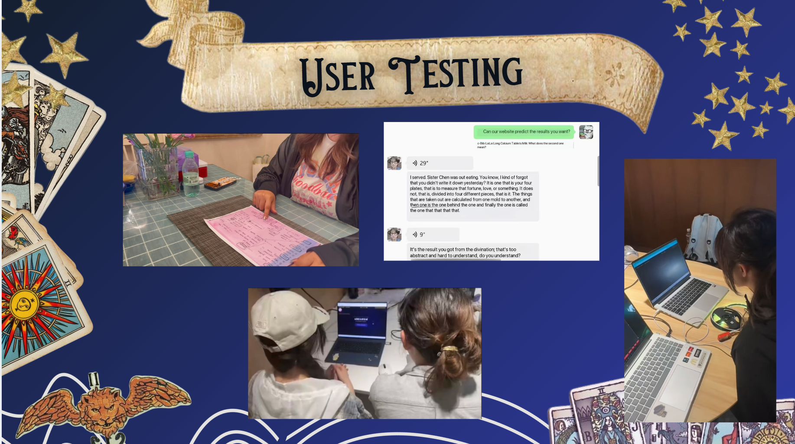
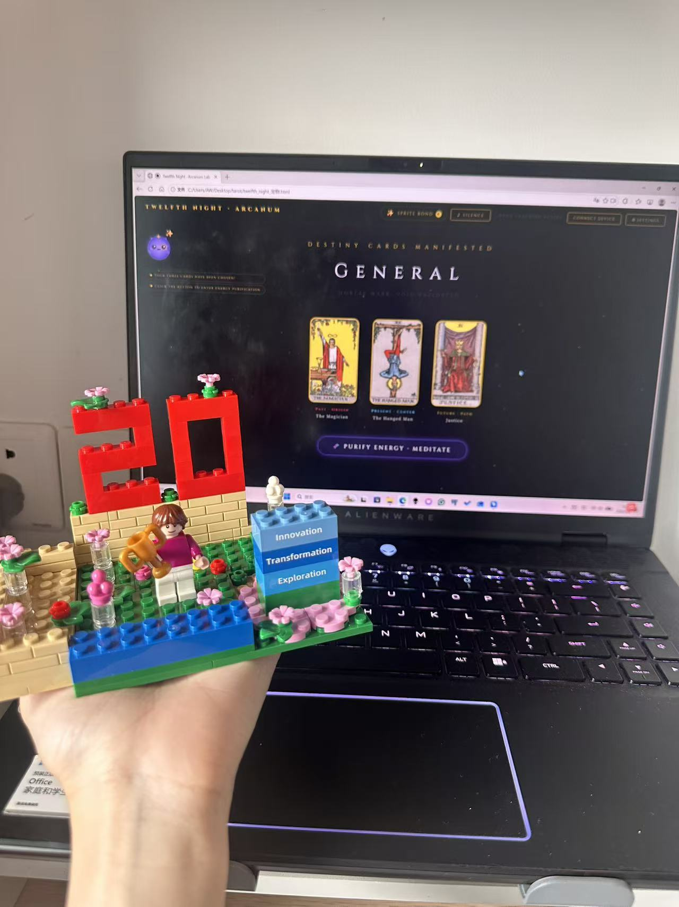
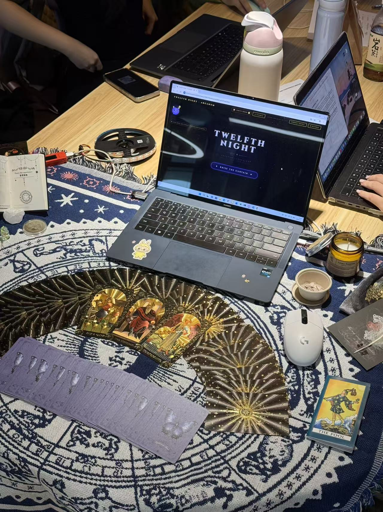

<div align="center">


# 🔮 Luckie-Bot

### AI-Powered Tarot Companion · Hardware × LLM × Computer Vision

<br>

[]()
[]()
[]()
[]()
[]()

</div>

<br>

---

## What is Luckie-Bot?

An end-to-end AI product combining a physical companion device with an immersive web app for tarot divination. Users interact through **natural hand gestures**, receive **AI-generated readings** from DeepSeek-V3, and watch their **digital garden grow** — while a hardware device responds in real time with dynamic lighting and expressions.

<p align="center">
  
</p>

> 🥇 **First Place** at XJTLU ENT 208 Demo Day. *"This isn't a course project — it's an investable MVP."*

---

## ✨ Features

| | |
|---|---|
| 🎴 **AI Oracle** | DeepSeek-V3 generates personalized, poetic readings for Wealth · Study · Love · General |
| ✋ **Gesture Control** | MediaPipe tracks 21 hand landmarks — pinch, palm, and fist to interact touch-free |
| 💡 **Hardware Companion** | M5StickC Plus responds with LED breathing lights, LCD facial expressions, and sound |
| 🌱 **Psionic Garden** | Your virtual plant grows with each session — 5 stages from Seed to Cosmic Tree |
| 🧘 **Meditation** | Guided breathing orb with particle effects before each reading |

### 🌱 Psionic Garden — Growth in Action

<p align="center">
  <video src="docs/screenshots/garden-growth.mp4" autoplay muted loop playsinline width="85%"></video>
</p>

Each divination feeds your garden. Persistent growth across sessions turns repeat usage into a visual journey — a living record of your interaction with the AI.

---

## 🏆 Demo Day

<p align="center">
  
  &nbsp;&nbsp;
  
</p>

| Dimension | Judges' Take |
|-----------|--------------|
| **Innovation** | "A novel intersection of AI, IoT, and wellness — we haven't seen this category before." |
| **Technical Depth** | "3-tier production architecture. The gesture pipeline alone demonstrates strong engineering." |
| **UX** | "Visual polish and interaction fluidity exceed typical course projects. Feels commercial." |
| **Business** | "Clear monetization path. Hardware + subscription creates both revenue and lock-in." |

---

## 🏗️ How It Works

```
Browser (Gesture + UI)  ◄── WebSocket ──►  Python Bridge  ◄── Serial ──►  M5StickC Plus
        │                                       │                               │
        ▼                                       ▼                               ▼
  DeepSeek-V3 API                        Command Router                   LED · LCD · Buzzer
  MediaPipe Hands                       (asyncio, <20ms)               (Ambient Feedback)
```

| Layer | Tech | Role |
|-------|------|------|
| 🖥️ **Frontend** | Vanilla JS · Canvas 2D · CSS 3D | Gesture pipeline, particle effects, 3D card flip, AI response rendering |
| 🌉 **Bridge** | Python · asyncio · WebSocket · pyserial | Real-time bidirectional relay, multi-client connection management |
| 🔌 **Hardware** | MicroPython · ESP32 · SK6812 LED | Ambient feedback loop, facial expression engine, standalone input |

---

## 🚀 Deploy in 3 Minutes

```bash
git clone https://github.com/GunGunLin/luckie-bot.git
cd luckie-bot
pip install websockets pyserial
cd bridge && python server.py
# Open http://localhost:8080 → enter API key → done ✨
```

> **Need the hardware?** Flash `firmware/main.py` to M5StickC Plus via [Thonny](https://thonny.org/). The web app works standalone without hardware.

---

## 📂 What's Inside

```
luckie-bot/
├── web/index.html          # Zero-dependency SPA (1450 LOC)
│   └── assets/cards/       # 78 tarot card images
├── bridge/server.py        # WebSocket ↔ Serial relay
├── firmware/main.py        # M5StickC Plus MicroPython firmware
├── hardware/               # Device reference photos
└── docs/                   # Logo · screenshots · demo media
```

---

## 💼 Business Model

Modern wellness seekers want personalized, tangible spiritual experiences. Existing apps are screen-only and generic.

**Luckie-Bot bridges the physical-digital gap:**

| Revenue Stream | Price | What They Get |
|---------------|-------|---------------|
| Device | $49–79 | M5StickC Plus + LED strip |
| Premium | $4.99/mo | Unlimited AI readings, advanced spreads, companion skins |
| Deluxe Kit | $129 | Device + 1yr premium + physical tarot deck |

**Defensible moat:** Hardware-software integration. No pure-app competitor can replicate the tangible, multi-sensory experience.

---

<div align="center">

<br>

### 🏆 ENT 208 Demo Day Champion · XJTLU

</div>
