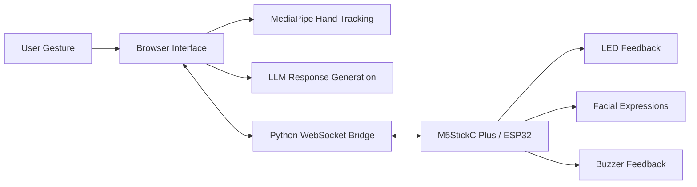

<div align="center">

<br>


# Twelfth Night

### An Embodied Generative AI Companion for Multimodal Human-AI Interaction

<br>

*Gesture Input · LLM Generation · Real-Time Visual Rendering · Hardware-Synchronised Feedback*

<br>

[]()
[]()
[]()
[]()
[]()
[]()

</div>

<br>

---

## Academic Summary

**Twelfth Night** is an embodied generative AI system that explores how large language models can move beyond text-based chat interfaces into tangible, multimodal, emotionally engaging human-AI interaction. The project integrates LLM-powered response generation (DeepSeek-V3), real-time hand-gesture recognition (Google MediaPipe), browser-based visual rendering (Canvas 2D + CSS 3D), and hardware-synchronised ambient feedback (M5StickC Plus / ESP32 with SK6812 LED strip) into a single, coherent, deployable system.

The system was developed as a venture-style MVP and won **First Place** at the XJTLU ENT 208 Demo Day, evaluated across innovation, technical depth, user experience, and business viability. It serves as both a technical demonstration of multimodal AI integration and a product-design exploration of how embodied interaction can make generative AI feel more present, personal, and emotionally resonant.

> *Twelfth Night was originally developed under the working name "Luckie-Bot" for XJTLU ENT 208.*

<br>

<p align="center">
  
</p>

---

## Product Vision

Most LLM products still live inside text boxes. The dominant interaction paradigm — type a prompt, read a response — reduces generative AI to a command-line experience.

**Twelfth Night asks a different question:** what happens when an AI system becomes physical, expressive, and ritualised?

Users interact through natural hand gestures rather than keyboards. The AI response is not just displayed — it is timed to a breathing animation, synchronised with LED lighting on a physical companion device, and embedded in a persistent visual journey that evolves across sessions. The system uses a tarot-inspired interaction metaphor as a **design vehicle for emotionally meaningful AI companionship**, not as a predictive or supernatural tool.

The project demonstrates that meaningful AI innovation requires more than model capability. It requires **interaction design, system integration, real-time reliability, and a credible product narrative** — all working together.

<br>

<p align="center">
  
  <br>
  <sub>User experiencing the embodied AI interaction flow</sub>
</p>

---

## 🏗️ System Architecture



### Layer 1 — Browser (Interaction & Rendering)

The browser hosts a single-page application with zero framework dependencies. MediaPipe Hands (WebAssembly) performs client-side gesture detection at 30fps with no server round-trips. LLM responses are fetched via HTTPS with **background prefetching** during the breathing animation to mask API latency. Visual rendering combines Canvas 2D (procedural starfield, particle system) with CSS 3D transforms (card flip animation) and glassmorphism UI.

### Layer 2 — Bridge (Real-Time Communication)

A Python asyncio server relays commands between the browser and the hardware device. WebSocket handles browser communication; pyserial handles device communication. A dedicated reader thread provides non-blocking serial I/O. The server also hosts the static web application, making the system fully self-contained.

### Layer 3 — Device (Physical AI Presence)

The M5StickC Plus runs MicroPython firmware that drives a SK6812 LED strip (6 animation modes), renders 7 facial expressions on the 240×135 LCD, and responds to physical button input. The device can operate standalone or as a synchronised companion to the web experience.

> **Detailed architecture:** See [docs/ARCHITECTURE.md](docs/ARCHITECTURE.md)

---

## ✨ Key Features

### Gesture-Based Interaction

Users interact through natural hand gestures — pinch, palm, and fist — tracked in real time by MediaPipe's 21-landmark hand model. This replaces keyboard-and-mouse prompting with an embodied, intuitive interaction ritual.

### LLM-Powered Personalisation

Every interaction generates a unique, context-aware response through DeepSeek-V3. The system uses structured prompt engineering to produce consistent, reflective, and emotionally appropriate outputs — not canned templates.

### Hardware-Synchronised Feedback

A physical companion device responds in real time: LED breathing patterns, LCD facial expressions, and buzzer tones synchronise with the browser experience. This makes the AI feel present beyond the screen.

### Persistent Interaction Memory

A visual companion evolves across sessions, creating a journey-based engagement model. This is a **persistent interaction memory** metaphor that demonstrates how AI products can build long-term user relationships.

<p align="center">
  
</p>

### Venture-Style MVP

The project was designed not only as a technical prototype, but as a complete product concept with user experience design, storytelling, commercial logic, and a live-demonstration-ready reliability standard.

---

## 🛠️ Technical Stack

| Layer | Technologies | Purpose |
|-------|-------------|---------|
| **Web Interface** | HTML5 · CSS3 · JavaScript · Canvas 2D · MediaPipe WASM | Gesture input, visual rendering, interaction flow |
| **AI Generation** | DeepSeek-V3 · SiliconFlow API | Personalised response generation |
| **Bridge Server** | Python 3 · asyncio · WebSocket · pyserial | Real-time browser-to-hardware communication |
| **Firmware** | MicroPython · ESP32 · SK6812 RMT driver | Hardware behaviour and feedback control |
| **Hardware** | M5StickC Plus · SK6812 LED strip · Buzzer · LCD | Physical companion presence |

---

## 🔧 Technical Challenges

**Real-time multi-layer synchronisation.** The system must coordinate three asynchronous domains — browser animation (~16ms frames), WebSocket messaging (~5ms), and serial UART (~1ms) — while an LLM call introduces 2–8 seconds of variable latency. Solution: background API prefetching during a breathing animation that provides a natural latency buffer.

**Stable gesture recognition for live demonstration.** MediaPipe's 21-landmark hand model produces noisy signals under varying lighting and hand orientations. Solution: per-gesture detectors (pinch, palm, fist) with individually tuned thresholds and a 300ms debounce state machine — empirically calibrated for reliability over responsiveness.

**WebSocket-to-serial protocol design.** The MicroPython heap (~60KB available) cannot accommodate JSON parsing. Solution: a lightweight text-based protocol that is human-readable, requires zero parser overhead on the device, and supports 15+ command types.

**Live demonstration reliability.** Any single-layer failure would break the entire experience in front of judges. Solution: graceful degradation at every layer — the web app works standalone without hardware; the hardware works standalone without the web app; the UI shows loading states if the LLM is slow.

**Emotional product design within technical constraints.** Creating an experience that feels meaningful while remaining technically honest. Solution: the interaction metaphor provides emotional texture; the system's AI nature is disclosed; no supernatural or predictive claims are made.

---

## 🏆 Demo Day

Twelfth Night, originally developed as Luckie-Bot, won **First Place** at the XJTLU ENT 208 Demo Day.

| Dimension | Assessment |
|-----------|------------|
| **Innovation** | A novel intersection of generative AI, computer vision, and IoT into a coherent product |
| **Technical Depth** | Production-style three-layer architecture with real-time synchronisation |
| **User Experience** | Polished multi-sensory interaction flow exceeding typical course-project standards |
| **Business Viability** | Credible monetisation model with a defensible hardware-software integration moat |
| **Live Demonstration** | End-to-end real-time AI + gesture + hardware demo executed without technical failure |

The demonstration ran live on stage — real AI generation, real gesture tracking, real hardware feedback, no pre-recorded segments.

> **Full context:** See [docs/DEMO_DAY.md](docs/DEMO_DAY.md)

<br>

<p align="center">
  
  &nbsp;&nbsp;
  
  <br>
  <sub>Live demonstration at XJTLU ENT 208 Demo Day</sub>
</p>

---

## 🚀 Quick Start

```bash
git clone https://github.com/GunGunLin/luckie-bot.git
cd luckie-bot
pip install -r requirements.txt
cd bridge && python server.py
```

Open **http://localhost:8080** in a modern browser. Enter your free [SiliconFlow](https://siliconflow.cn) API key in Settings (⚙️). The web application runs standalone — no hardware required.

> **Detailed setup:** See [docs/SETUP.md](docs/SETUP.md)

### Optional: Hardware Companion

Flash `firmware/main.py` to an M5StickC Plus via [Thonny](https://thonny.org/). Connect the device over USB. The bridge server auto-detects the serial port and establishes communication.

---

## 📂 Repository Structure

```text
twelfth-night/
├── web/                       # Browser interaction layer (HTML/CSS/JS)
│   ├── index.html             #   Application shell and structure
│   ├── styles/
│   │   └── main.css           #   All visual styling (~470 lines)
│   ├── scripts/
│   │   ├── app.js             #   Core state, scenes, UI rendering
│   │   ├── gesture.js         #   MediaPipe hand tracking pipeline
│   │   ├── aiClient.js        #   LLM API integration and response parsing
│   │   └── hardwareClient.js  #   WebSocket and Web Serial communication
│   └── assets/cards/          #   Visual card assets (78 illustrations)
├── bridge/                    # Python communication relay
│   ├── server.py              #   Entry point: HTTP + WebSocket + serial
│   ├── config.py              #   Configuration constants
│   ├── serial_client.py       #   Serial port detection and I/O
│   └── websocket_server.py    #   WebSocket client handler
├── firmware/                  # MicroPython firmware for ESP32 device
│   ├── main.py                #   Device behaviour, LED, faces, protocol
│   └── config.example.py      #   Hardware configuration reference
├── hardware/                  # Device photos and prototype references
├── docs/                      # Documentation, architecture, demo media
│   ├── ARCHITECTURE.md        #   Detailed three-layer system design
│   ├── RESPONSIBLE_AI.md      #   AI safety and ethical considerations
│   ├── DEMO_DAY.md            #   Entrepreneurship context and results
│   ├── SETUP.md               #   Comprehensive installation guide
│   └── screenshots/           #   Demo GIFs, photos, visual documentation
├── requirements.txt           # Python dependencies
├── .env.example               # Environment configuration template
├── LICENSE                    # MIT License
└── README.md
```

---

## 💡 Innovation & Business Case

### Problem

Most AI companion products remain **screen-only and text-bound**. Users type prompts into a chat interface and read responses — an interaction paradigm unchanged since the earliest chatbots. This limits the emotional depth, physical presence, and experiential quality of human-AI interaction.

### Opportunity

Generative AI creates an opportunity for **embodied, multimodal AI experiences** that engage users through gesture, vision, sound, and physical feedback — not just text. The growing interest in AI companionship and digital wellness suggests a market receptive to products that make AI feel more present and personal.

### Our Approach

Twelfth Night demonstrates a **hardware-software integrated product model**:

| Component | Role |
|-----------|------|
| **Device** | One-time purchase (hardware companion with LED strip) |
| **Software** | Free core experience with gesture interaction and AI responses |
| **Premium** | Optional subscription for advanced features and personalisation |

### Differentiation

- **Hardware-software integration** creates a barrier that pure-software competitors cannot easily replicate
- **Multi-sensory interaction** (gesture + visual + lighting + sound) is more memorable than screen-only experiences
- **Persistent interaction memory** builds long-term engagement beyond single-session usage
- **Demonstrated reliability** — the system has been proven in a live, judged presentation environment

### Learning Outcome

This project demonstrates how generative AI systems can be turned into **user-facing products with technical, experiential, and commercial value** — a skill set directly relevant to applied AI innovation roles and research.

---

## 📋 Responsible AI

Twelfth Night is an AI interaction prototype. We take responsible design seriously:

- **Clear disclosure:** All AI-generated responses are for reflection and entertainment. The system does not provide professional advice of any kind.
- **Privacy-aware:** Gesture data is processed entirely client-side via MediaPipe WebAssembly. No hand landmark coordinates leave the user's browser. No persistent user profiles are stored on any server.
- **Transparent AI identity:** The system's AI nature is not hidden. No supernatural or predictive claims are made.
- **Emotional safety:** The interaction flow is session-based and time-limited. The system does not simulate ongoing relationships that could encourage over-reliance.

> **Full statement:** See [docs/RESPONSIBLE_AI.md](docs/RESPONSIBLE_AI.md)

---

## 🗺️ Roadmap

- [ ] Improve gesture robustness with fallback interaction modes (click/touch)
- [ ] Add persistent user memory with opt-in, privacy-aware design
- [ ] Develop modular prompt templates for varied interaction scenarios
- [ ] Improve hardware enclosure and industrial design
- [ ] Add quantitative evaluation of user engagement and interaction reliability
- [ ] Explore responsible AI safeguards for emotionally sensitive AI companionship
- [ ] Accessibility evaluation for gesture-based interfaces

---

## 💡 Design Lessons

Twelfth Night demonstrates that AI innovation is not only about model capability. Building a meaningful AI product requires:

- **Interaction design** — how users access and experience the AI matters as much as the AI itself
- **System integration** — connecting LLMs, computer vision, and hardware into a reliable real-time pipeline
- **Graceful degradation** — designing for failure modes at every layer so the experience holds together
- **Product narrative** — translating technical work into a story that non-technical audiences can understand and trust
- **Live reliability** — building something that works on stage, not just on a development machine

The project reflects an approach to AI development that values **responsible design, system-level thinking, and emotionally meaningful interaction** — work that sits at the intersection of technical capability and human experience.

---

## 📄 License

MIT License — see [LICENSE](LICENSE)

---

<div align="center">

<br>

### Twelfth Night · An Embodied AI Companion

*Gesture Input · LLM Generation · Hardware-Synchronised Feedback*

<br>

🥇 **XJTLU ENT 208 Demo Day Champion**

</div>
